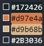

## Sistema de Login

Este projeto é um Sistema de simples de Login, onde o usuário precisa está registrado para efeturar o login no site. Os dados dos usuários cadastrados são guardados localmente, caso o usuário esteja devidamente cadastrado mas por um acaso digitou o email ou senha de acesso errado aparecerá na tela um aviso.
### Ferramentas

* React.js
* Contexts API
* Hooks
* JavaScript

### Paletas de cores utilizadas no projeto

* #172426
* #d97e4a
* #d9b68b
* #2B3036
